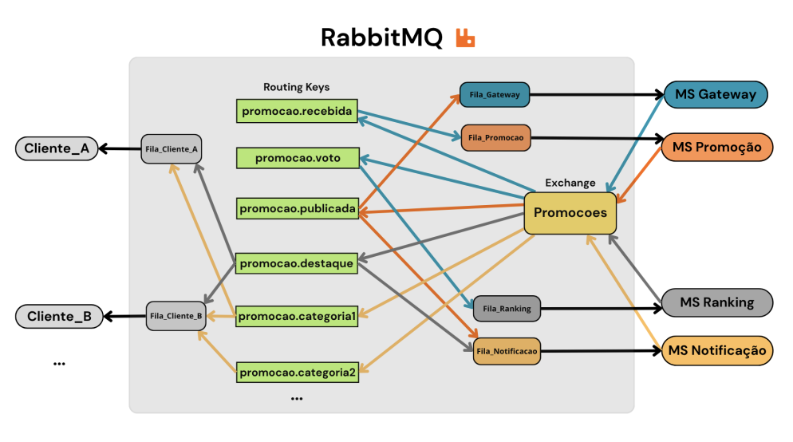

# Sistema de Promoções




Trabalho da disciplina de Sistemas Distribuídos - PPGCA/UTFPR.

Sistema de gerenciamento de promoções usando microsserviços, RabbitMQ (exchange topic) e assinatura digital RSA.

## Arquitetura

Quatro microsserviços independentes que se comunicam exclusivamente via RabbitMQ:

- **ms-gateway**: interface CLI para cadastrar promoções, listar e votar
- **ms-promotion**: valida e publica promoções recebidas
- **ms-ranking**: processa votos e detecta hot deals (score ≥ 5)
- **ms-notification**: redistribui notificações por categoria para os clientes

Os **client** são processos que se inscrevem nas categorias de interesse e exibem as notificações no terminal.

Toda mensagem publicada é assinada digitalmente com RSA (SHA-256). O consumidor valida a assinatura antes de processar.

## Requisitos

- [Bun](https://bun.sh)
- Docker (para o RabbitMQ)

## Como rodar

Sobe o RabbitMQ:

```bash
docker compose up -d
```

Gera as chaves RSA (uma vez só):

```bash
bun generate-keys.ts
```

Instala as dependências de cada serviço:

```bash
cd shared && bun install && cd ..
cd ms-gateway && bun install && cd ..
cd ms-promotion && bun install && cd ..
cd ms-ranking && bun install && cd ..
cd ms-notification && bun install && cd ..
cd client && bun install && cd ..
```

Inicia cada microsserviço em um terminal separado, nessa ordem:

```bash
cd ms-promotion && bun start
cd ms-ranking && bun start
cd ms-notification && bun start
cd ms-gateway && bun start
cd client && bun start
```

O painel do RabbitMQ fica disponível em http://localhost:15672

> Usuario: `guest` senha: `guest`.

## Routing keys

| Evento                          | De           | Para                           |
| ------------------------------- | ------------ | ------------------------------ |
| `promocao.recebida`             | Gateway      | Promotion                      |
| `promocao.publicada`            | Promotion    | Gateway, Ranking, Notification |
| `promocao.voto`                 | Gateway      | Ranking                        |
| `promocao.<categoria>`          | Notification | Clientes                       |
| `promocao.<categoria>.destaque` | Ranking      | Notification                   |
