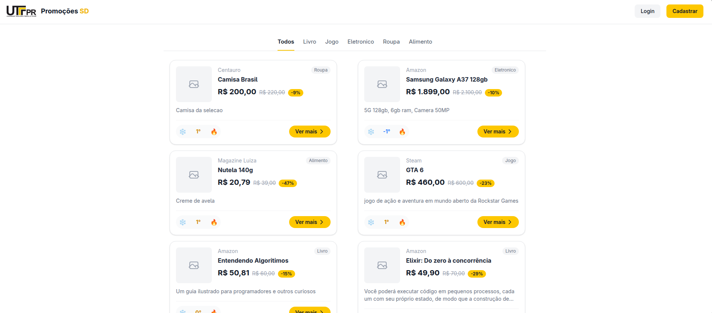
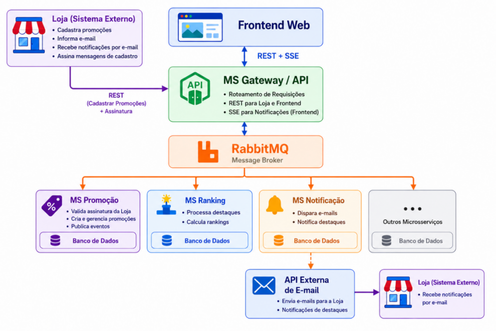

# Sistema de Promoções




Atividade da disciplina de Sistemas Distribuídos - PPGCA/UTFPR, [Profª. Ana Cristina Barreiras Kochem Vendramin](https://sites.google.com/view/anacristina-kochemvendramin).

Sistema de gerenciamento de promoções usando microsserviços, RabbitMQ (exchange topic), assinatura digital RSA, SSE e frontend web (Svelte + Vite + Tailwind CSS).

Este projeto possui duas implementações do cliente, em branches diferentes:

- **`main`** (esta branch): cliente com frontend web escrito em Svelte.
- **`cli-client`**: cliente em CLI escrito em Node.js.

## Requisitos

- [Bun](https://bun.sh)
- [Docker](https://www.docker.com)(para o RabbitMQ)

## Como rodar

Sobe o RabbitMQ:

```sh
docker compose up -d
```

Gera as chaves RSA (uma vez só):

```sh
bun generate-keys.ts
```

Instala as dependências de cada aplicação:

```sh
cd shared && bun install
cd ms-gateway && bun install
cd ms-promotion && bun install
cd ms-ranking && bun install
cd ms-notification && bun install
cd client && bun install
cd store && bun install
```

Crie o `.env` de cada microsserviço a partir do `.env.example` e configure as variáveis de ambiente conforme necessário.

Inicia cada aplicação em um terminal separado:

```sh
cd ms-promotion && bun start
cd ms-ranking && bun start
cd ms-notification && bun start
cd ms-gateway && bun start
cd client && bun start # Frontend web
cd store && bun start # TUI da loja
```

O frontend fica disponível em [http://localhost:5173](http://localhost:5173)

O painel do RabbitMQ fica disponível em [http://localhost:15672](http://localhost:15672)

A documentação da API REST esta disponível [aqui](./docs/API.md).

> Acesso do RabbitMQ, usuário: `guest` senha: `guest`.

## Arquitetura



Quatro microsserviços independentes que se comunicam exclusivamente via RabbitMQ:

- **ms-gateway**: API REST que recebe promoções da loja, lista promoções e recebe votos dos clientes, publica eventos no RabbitMQ e envia notificações SSE para o frontend web.
- **ms-promotion**: valida e publica promoções recebidas
- **ms-ranking**: processa votos e detecta hot deals (score ≥ 5)
- **ms-notification**: redistribui notificações por categoria para os clientes e envia e-emails para a loja quando uma promoção é confirmada e/ou detectada como hot deal.

A **store** simula o backoffice da loja, envia promoções para o gateway (não é um microsserviço, apenas um script).

O **client** é um frontend web (Svelte + Vite + Tailwind CSS) que permite ao usuário se inscrever nas categorias de interesse e exibe as notificações recebidas em tempo real na interface.

Toda mensagem publicada é assinada digitalmente com RSA (SHA-256). O consumidor valida a assinatura antes de processar.

## Routing keys


| Evento                          | De           | Para                                  |
| ------------------------------- | ------------ | ------------------------------------- |
| `promocao.recebida`             | Gateway      | Promotion                             |
| `promocao.publicada`            | Promotion    | Gateway, Ranking, Notification        |
| `promocao.voto`                 | Gateway      | Ranking                               |
| `promocao.<categoria>`          | Notification | Clientes                              |
| `promocao.<categoria>.destaque` | Ranking      | Notification                          |
| `ranking.score`                 | Ranking      | Gateway (sincroniza DB entre os 2 MS) |

<div align="center">

#### Made with 💙 in Bahia.

</div>
